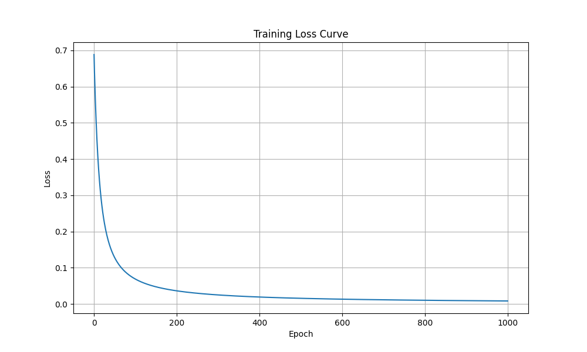

# 逻辑回归 - 从零手写实现

> 用纯 NumPy 实现二分类逻辑回归，理解梯度下降完整训练循环

## 📚 项目简介

这是一个**教育性质的机器学习项目**，从零手写实现逻辑回归算法，不使用 scikit-learn 等高级库，帮助深入理解：

- Sigmoid 激活函数
- 交叉熵损失函数
- 梯度计算（矩阵求导）
- 梯度下降优化

## 🎯 实现功能

- ✅ 前向传播（线性变换 + Sigmoid 激活）
- ✅ 交叉熵损失计算
- ✅ 梯度计算（权重 + 偏置）
- ✅ 梯度下降参数更新
- ✅ 训练/测试集评估
- ✅ 损失曲线可视化

## 📊 实验结果

**数据集**：Iris 鸢尾花数据集（前两类二分类）
- 训练集：80 个样本，4 个特征
- 测试集：20 个样本

**性能**：
```
训练集准确率: 100.00%
测试集准确率: 100.00%
```

**混淆矩阵**（测试集）：
```
[[12  0]
 [ 0  8]]
```

**损失曲线**：



## 🚀 运行方式

### 1. 环境准备

```bash
# 创建虚拟环境（如果还没有）
cd ml-from-scratch
python -m venv venv

# 激活虚拟环境
# Windows PowerShell:
venv\Scripts\Activate.ps1
# Windows CMD:
venv\Scripts\activate.bat

# 安装依赖
pip install numpy matplotlib scikit-learn
```

### 2. 运行训练

```bash
cd logistic_regression
python train.py
```

输出：
- 控制台：每 100 轮打印一次损失
- 文件：`loss_curve.png` 损失曲线图

## 📝 核心代码

### 前向传播
```python
def forward(X, w, b):
    z = np.dot(X, w) + b
    predictions = sigmoid(z)
    return predictions
```

### 损失计算（交叉熵）
```python
def compute_loss(y_true, y_pred):
    n = len(y_true)
    term = y_true * np.log(y_pred + 1e-15) + (1 - y_true) * np.log(1 - y_pred + 1e-15)
    loss = -np.sum(term) / n
    return loss
```

### 梯度计算
```python
def compute_gradients(X, y_true, y_pred):
    n = len(y_true)
    error = y_pred - y_true
    grad_w = X.T @ error / n  # 权重梯度
    grad_b = np.sum(error) / n  # 偏置梯度
    return grad_w, grad_b
```

### 参数更新（梯度下降）
```python
w = w - learning_rate * grad_w
b = b - learning_rate * grad_b
```

## 🧠 关键知识点

### 1. Sigmoid 函数
将线性输出 `z` 压缩到 [0, 1] 区间，表示概率：
```
σ(z) = 1 / (1 + e^(-z))
```

### 2. 交叉熵损失
衡量预测概率与真实标签的差距：
```
Loss = -1/n * Σ[y·log(p) + (1-y)·log(1-p)]
```

### 3. 梯度公式（交叉熵 + Sigmoid 的魔法）
```
∂Loss/∂w = 1/n * X^T · (y_pred - y_true)
∂Loss/∂b = 1/n * Σ(y_pred - y_true)
```

### 4. 梯度下降
沿梯度反方向更新参数，逐步降低损失：
```
w_new = w_old - learning_rate * grad_w
b_new = b_old - learning_rate * grad_b
```

## 📖 学习路径

这是 **ML From Scratch** 系列的第二个项目，建议学习顺序：

1. ✅ [线性回归](../linear_regression/) - 理解梯度下降基础
2. ✅ **逻辑回归**（当前） - 理解分类 + 交叉熵 + 完整训练循环
3. 🔜 决策树 - 理解非线性模型
4. 🔜 神经网络 - 理解多层感知机

## 🛠️ 技术栈

- **Python 3.10+**
- **NumPy** - 矩阵运算
- **Matplotlib** - 可视化
- **scikit-learn** - 仅用于数据加载和评估指标

## 📄 许可证

MIT License

---

**作者**：Grx  
**日期**：2026-07-13  
**项目系列**：[ML From Scratch](https://github.com/grxki/ml-from-scratch)
